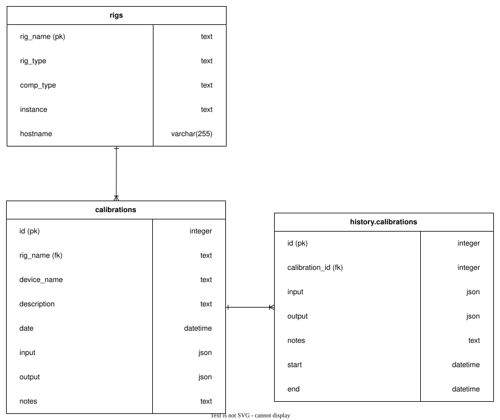

# Calibration API

[](LICENSE)

Calibration API: an API to store calibration data for various rigs at the Allen Institute.

## Design 

### Calibration Database Schema



##  Developers Guide

### Local Installation

1. Install [uv](https://docs.astral.sh/uv/getting-started/installation/)

1. Clone project

    ```bash
    git clone https://github.com/AllenNeuralDynamics/calibration-api.git
    ```

1. (WFH/VPN ONLY) Perform the following steps if using the Allen Institute VPN. These steps will connect to the postgresql database that is within the institute network.

    1. Open ``calibration-api > src > calibration-api > database > session.py`` and make the following changes: 
        ```
        url_object = URL.create(
            "postgresql+psycopg2",
            username="calibration",    
            password="*******",
            # host="eng-tools",     # <-- Comment this out
            host="localhost",       # <-- Uncomment this line
            port=5432,
            database="calibration"
        )
        ```
    1. ssh tunnel to the postgresql database with the following command: 
        ```
        ssh -L 5432:localhost:5432 eng-tools
        ```

1. Run the following code in the project to start up local instance of API server

    ```bash
    uv run fastapi dev 
    ```

1. Go to http://127.0.0.1:8000/docs to test endpoints 

### Test, Type, Lint

Use tox to run testing, typing, and linting

```bash
tox -e test,type,lint
```

### Database Connection

TODO: hehe credentials are hardcoded in still. bad.

The PostgresSQL database is hosted on eng-tools:5432. Reach out to [Jessy](jessy.liao@alleninstitute.org) or someone from the SIPE team for credentials. 

The sql script to setup the database can be found [here](database/setup.pgsql).


